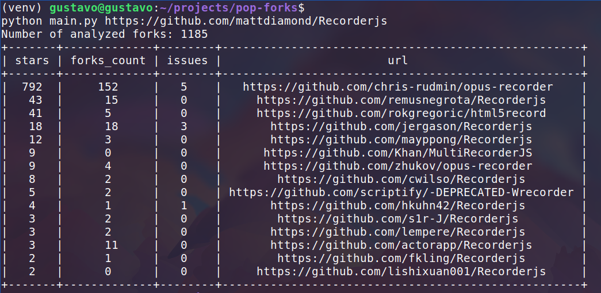

# pop-forks

Simple python project that list the most starred forks of a github repository

## Usage
 - install python requirements listed in requirements.txt
 - run: ```python main.py <repository_url> <top_quantity>```
 - repository_url is required, here is an exemple: ```https://github.com/python/cpython```
 - top_quantity is optional and the default value is 15

## Example of usage

